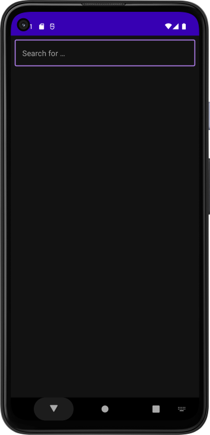
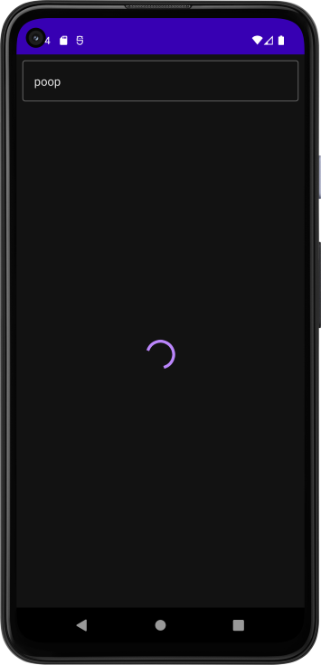
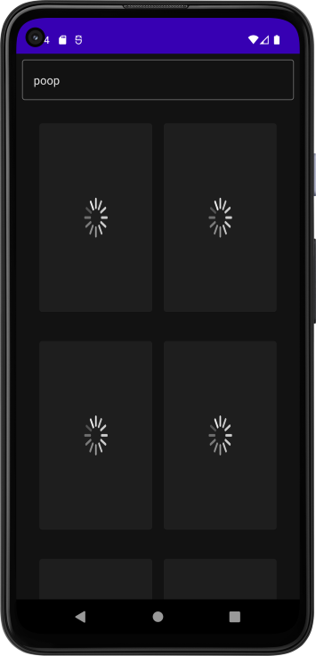

# Codelab Internet Access App - Bookshelf App
Simple app to demonstrate internet access.  
The app lets the user Search for Books via Google Book API  
The App display asynchronously downloaded images of the book covers

### Note:
I did this project twice, this one has the minimum features   
per codelab requirements. Just the image and title are retrieved.  
In the other Bookshelf project it goes into a lot of more details.

## Migrated Dependency Injection to Dagger-Hilt
From Manual DI to DI with Dagger-Hilt
- git branch di_dagger_hilt
- git branch di_manual

[Codelab "Project: Create a Bookshelf app" at developer.android](https://developer.android.com/courses/pathways/android-basics-compose-unit-5-pathway-2#codelab-https://developer.android.com/codelabs/basic-android-kotlin-compose-bookshelf )

### ScreenShots

  
  
  

  

---

ref: codelab-minimal-bookshelf-app-android-kotlin-compose